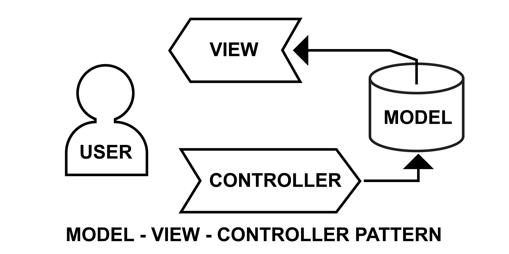

# CRUD USANDO MVC POR INYECCION DE DEPENDENCIAS

Como tal se uso el MVC, Modelo, Vista, Controlador cual es la funcion o que hace.

* **El Modelo:** gestiona la interaccion con la base de datos (CRUD: Crear, Leer, Actualizar, Borrar).
* **La Vista:** Representa los datos al usuario final (archivos html/php con plantillas).
* **El controlador:** recibe las peticiones del usuario via URL, interactua con el modelo y carga la vista correspondiente.

**Flujo del MVC**
Se realiza la peticion en el index.php, el controlador captura la peticion y determina que modelo y vista usar, el modelo obtiene o guarda datos en la base de datos, y la vista muestra la informacion recibida del controlador al usuario.

**DB configuracion**
En cuanto a la configuracion de la db se pasa los parametros para la conexion y se va a realizar por inyeccion de dependencia, inyeccion de dependencia(DI) es un patron de diseño que permite a una clase recibir sus dependencias desde el exteriror, en lugar de crearlas internamente.

Como sugerencia para crear un CRUD con MVC primero crear la BD con sus tablas y demas, en otras palabras que este completa. Posteriormente crear el MODEL donde ya que esta es la que se comunica con la DB y crea todo practicamente. despues de esta se crea el CONTROLLER el cual es el que se comunica con el MODEL osea realiza peticiones. Sigue el INDEX.PHP el cual es el punto de entrada este index recibe las variables por la URL por lo tanto instancia en CONTROLLER y ejecuta la accion que el usuario pidio el fin del index es centralizar todo y evitar los archivos sueltos o mal comunicados en otras palabras todo pasa por el index. Por ultimo seria el VIEW estas sera lo que el usuario ve e interactua, esto solo contiene etiquetas HTML y pequeños ecos o partes de PHP para mostrar lo que el controlador les envio



---

# Codigo de configuracion de la base de datos

**Se va a usar la inyeccion de dependencias**
Parte encargada de la conexion a la db en este caso a supabase:

* **$host:** es la url para conectar a la base de datos.
* **$port:** el puerto por donde se conecta.
* **$database:** el nombre de la base de datos.
* **$user:** identificador de la unico de la base de datos.
* **$pass:** el password que se le coloco a la base de datos.

---

# Se crea la clase para la conexion

La clase conexion se encarga de crear valga la redundancia la conexio a la basse de datos con unos parametros fijos que regularme siempre se utilizan en estos caso como el host, port, databse, user y pass estos nombres de variables pueden cambiar un poco pero sigue siendo lo mismo 

---

```php
<?php
    /*Parte encargada de la conexion a la db en este caso a supabase
    En cuanto al host es la url para conectar a la base de datos*/
    $host = '';
    // el puerto por donde se conecta
    $port = '';
    // el nombre de la base de datos
    $database = '';
    // identificador de la unico de la base de datos
    $user = '';
    // el password que se le coloco a la base de datos
    $pass = '';

    /*Se va a usar la inyeccion de dependencias
    Se crea la clase para la conexion*/
    class conexion{
        //Variable tipo privada
        private $pdo;
        //Se crea la funcion y la constructor se le pasa los datos de la coexion a la db
        public function __construct($host, $port, $database, $user, $pass){
            //El try y catch es para validar errores
            try {
                //Se usa el pgsql que permite la comuncacion entre php y la base de datos 
                $dsn ="pgsql:host=$host;port=$port;dbname=$database";
                //En esta parte se crea el objeto con new
                $this -> pdo = new PDO($dsn, $user, $pass);
                //Manejo de errores -> para llamar al meotodo que le pertenece al objeto 
                $this -> pdo -> setAttribute(PDO::ATTR_ERRMODE, PDO::ERRMODE_EXCEPTION);
            } catch (PDOException $e) {
                //Mensaje de error contadenado a la exception 
                error_log("Error al conectarse a la base de datos".$e->getMessage());
                //Die es un alias del exit detiene la ejecucion y muestra un mensaje de manera opcional, usuario 
                die("Error en la conexion del servidor");
            }
        }
        //Funcion para que otras clases puedan usar la conexion osea devuleve el obejto pdo
        public function getConexion(){
            return $this->pdo;
        }
    }
?>

```
---

# Codigo del model se encarga de proteger la base de datos

Gestiona los datos y la lógica de negocio. Consulta bases de datos, valida información y manipula el estado de la aplicación. En otras palabras se encarga de comunicar con la DB para realizar ciertas tareas como insertar, actualizar y demas interaciones directas con la DB osea maneja codigo sql.

---

```php
// se usa para establecer la conexion
require_once "config/db.php";
    
// Clase para la conexion a db    
class conexionDB{
    
    // Variable privada 
    private $db;

    // funcion constructor para conectar a la db
    public function __construct($db){

        /*Se le asigna la conexion de la base de datos a la variable privada db el cual trae la conexion con pdo desde db.php.
        $pdo tiene toda la configuracion para realizar la conexion*/
        $this->db = $db;
    }

    /* Se puede hacer asi con marcadores de posicion o con marcadores por nombre 
       funcion que sirve para crear el usuario en la db.
       Se le pasa los campos de la base de datos en los parametros. */
    public function crear($name, $lastname, $email, $phone){
        
        // Validamos la creacion del usuario
        try {
            
            // Variable a la que se le pasa el comando sql. Los ? son marcadores de posicion 
            $sql = "INSERT INTO usuarios (name, lastname, email, phone) VALUES(?, ?, ?, ?)";
            
            /* Variable donde se pasa el sql y el prepare.
               El prepare lo que hace es enviar una consulata a postgre sin los datos el motor de la base de datos 
               analiza la estrucutra del slq antes de que llegue cualquier info. Esto evita las inyecciones sql */
            $stmt = $this -> db -> prepare($sql);
            
            // Se regresa la consulta y se envia los datos al db
            return $stmt -> execute([$name, $lastname, $email, $phone]);
            
        } catch (PDOException $e) {
            
            // error log para nosotro el usuario no lo ve 
            error_log("Error al refistrar el usuario: ".$e->getMessage());
            
            die("Error al crear usuario");
            return false;
        }
    }

    //Funcion para crear usuario
    public function editar($id, $name, $lastname, $email, $phone){
        
        // Validamos el editar
        try {
            
            /*Variable con el comando sql.
            En esat parte se uso Parametros Nombrados como se ve en el values se hace con :nombre y en el execute se usa :nombre => variable asociada (clave -> valor).
            existen varias formas de hacer como por ejemplo remplazar :name por ? pero al usar ? esto obliga a mantener el orden en el execute y no se puede intercambiar, de esta forma no hay probelma por eso.
            Al usar marcadores y el prepare se porteje contra inyecciones SQL ya que los datos se envian separados de la instruccion*/
            $sql = "UPDATE usuarios SET name = :name, lastname = :lastname, email = :email, phone = :phone WHERE id = :id";
            
            // Variable donde se le pasa el sql y el prepare
            $stmt = $this -> db -> prepare($sql);
            
            /* Se envia o retorna el valor de $stmt y se envia a la db. tomando en cuenta lo anterior se recomienda mirar la funcion anterior de crear en la linea 104 con el fin de ver la direfencia entre los parametros nombrados y marcadores de posicion */
            return $stmt -> execute([':lastname' => $lastname, ':phone' => $phone, ':email' => $email, ':name' => $name, ':id' => $id]);
            
        } catch (PDOException $e) {
            
            // Error log para visiaulizar el tipo de error
            error_log("Error al editar el usuario: ".$e->getMessage());
            
            die("Error al editar el usuario");
            return false;
        }
    }

    // Funcion para listar o mostrar los datos
    public function listar(){
        
        // validamos listar
        try {
            
            // Variable que contiene el sql, se le pasa el comando que entiende la db
            $sql = "SELECT * FROM usuarios ORDER BY id ASC";
            
            // Sele pasa los valores de sql al stmt prepare es para que la db o el motor de este este lista para recibir la peticion
            $stmt = $this -> db -> prepare($sql);
            
            // manda la orden de executar a la db osea que haga lo que dice el sql al extraer los datos no se le pasa parametros por lo cual los datos estan en espera a ser procesados
            $stmt->execute();
            
            /* Devuelve los datos de la db en un array el fetch trae solo una fila el fetchall trea todos los datos que coincidan con esa consulta en un array.
               el PDO::FETCH_ASSOC es un meotod de extracion para que php cree un arraglo donde las llaves sean los nombres de las columnas de la tabla ej:(id,nombre,email..etc) sin esto PDO devolvera un arreglo duplicado por nombre y numero de columna gastando recursos */
            return $stmt -> fetchALL(PDO::FETCH_ASSOC);
            
        } catch (PDOException $e) {
            
            // Error log para visualizar el error 
            error_log("Error al realizar el listado de usuarios: ".$e->getMessage());
            
            // Retorna el array vacio para que el foreach no genere un error critico solo no muestra los datos y la pagina se cargara sin problemas
            return[];
        }
    }
}

```
---

# Codigo del controlador

Actúa como intermediario y "cerebro" que gestiona el flujo de la aplicación. Recibe las entradas del usuario (clics, formularios, URL), procesa la lógica de negocio, solicita datos al Modelo y selecciona la Vista adecuada para mostrar la respuesta, sin interactuar directamente con la interfaz. Solo se comunica con el model.

---

```php
<?php
require_once "model/usuario_model.php";

// Clase del controlador
class usuarioController{

    // Variable para guardar el modelo 
    private $model;

    // Funcion para la conexion a la db en db.php se crea la conexion con pdo
    public function __construct($pdo){
        
        
            /*Se inyecta y se crea el modelo se la pasa la conexion.
            Se hace refencia a la variable global tipo privada model con $this se puede usar dentro de esa funcion.
            se crea el objeto usuarioModel y se le pasa el valro que esta entre () que es $pdo.
            Todo lo anterior sirve para devolver la instancia de esa clase en usuario_model.php. En otras palabras entrega el objeto terminado y se guarda en model.
            Para que sirve esto, ya que se a hace una instancia (un objeto creado apartir de una calse) esta instancia  tiene metodos y funciones las cuales se usaran en momentos concretos si se ve el archivo model por ejemplo en la funcion de crearUsario este tiene codigo sql osea toca la base de datos mientras que controller no lo hace solo usa esa instacion para realizar esa accion */
        $this -> model = new usuarioModel($pdo);
    }

    // funcion para mostrar los datos en view lista_usuarios.php para eso se usa la funcion del model
    public function listaUsuario(){
        
        /* Se usa la misma variable que en view para que esta que tiene un array de los datos se pueda presentar, 
           adicional se le pasa la inyeccion que es model y la funcion que esta en model usuario_model.php */
        $listado = $this -> model -> listar();
        
        /* Se carga la funcion o el array a view sin esto no se visualiza en el listado_usuario.php la carga de los datos 
           igualmente si no se tiene no se visualiza los datos y si se coloca antes del $listado igual no funciona */
        require_once "view/lista_usuario.php";
    }

     //Funcion para crear datos
        public function crearUsuarioController(){
            /*Verifica que se haya enviado el formulario.
            Es una variable super global de phpun array $_server es un array que contiene informacion como encabezados, rutas y script las cuales son creadas por el servidor web.
            request_method es un metodo de peticion utilizado para haceder a la pagina opor ejemplo post, get, head, put.El post es el metodo estandar para enviar informacion sensible o pesada*/
            if ($_SERVER["REQUEST_METHOD"] == 'POST'){
                //Validacion que los datos existan y no esten vacios
                if (!empty($_POST['name']) && !empty($_POST['lastname']) && !empty($_POST['email']) && !empty($_POST['phone'])) {
                    $name = $_POST['name'];
                    $lastname = $_POST['lastname'];
                    $email = $_POST['email'];
                    $phone = $_POST['phone'];

                    //Se guarda los datos y direcciona segun el resultado
                    //el crearUsuario viene del model donde esta la funcion como tal
                    if ($this->db->crearUsuarioMode($name, $lastname, $email, $phone)) {
                        /*Esta linea lo que hace es que cuando se crea regresa al index pero con la etiqueta asignada esta linea se compone de 3 partes
                        La primera es el location sirve para que el navegador identifique el contenido, como se ve el navegador redireccionara al index.php
                        La segunda parte el cual es el ? sirve para deparar la ejecucion primero se llevara al index y con el ? el navegador sabra que no se esta toamdno ni archivos ni carpetas solo datos nada mas
                        La parte tercera es el msg=creado el msg puede ser cualquier palabra ya que es una variable el = pues le asigna un valor a esa variable y el creado el es valor de esa variable osea el contenido del mensaje en otras palabras msg es llave y creado es el valro (llave -> valor)
                        Por ultimo esto se visualizara en la URL del navegador*/
                        header("location: index.php?msg=creado");                        
                    }else {
                        //Esta parte es la misma logica que la anterior 
                        header("location: index.php?msg=error_db");
                    }
                    //Se usa el exit para evitar que lea las lineas de abajo osea la funcion termina aqui
                    exit();
                }else {
                    //En caso de que los campos esten vacios se redirecciona al index pero con una etiqueta de error
                    header("location: index.php?msg=error_campos_vacios");
                    //los mismo que el anterior
                    exit();
                }
            }
        } 
}
?>

```
---

# Codigo de las vistas html y php

Esta es la parte visual del codigo lo que ve e interactua el usuario como tal se creo 3 vistas la principal que seria lista_usuario.php que muestra en pantalla todas las listas de los usuarios registrados en la DB la vista del editar_usuarios.php y por ultimo la vista de crear_usuario.php estas vistas se manejan por medio del index igual que todo lo demas. Tener presente que se uso bootstrap para algunas cosas en todas las vistas al igual que el css 

---

```html
<!DOCTYPE html>
<!--Codigo html para visualizar el listado de los usuarios-->
<html lang="en">
<head>
    <meta charset="UTF-8">
    <meta name="viewport" content="width=device-width, initial-scale=1.0">
    <link rel="stylesheet" href="/css/styles.css">
    <link href="https://cdn.jsdelivr.net/npm/bootstrap@5.3.8/dist/css/bootstrap.min.css" rel="stylesheet" integrity="sha384-sRIl4kxILFvY47J16cr9ZwB07vP4J8+LH7qKQnuqkuIAvNWLzeN8tE5YBujZqJLB" crossorigin="anonymous">
    <title>Listado de Usuarios</title>
</head>
<body>
    <!--Titulo-->
    <h1>LISTADO DE USUARIOS</h1>
    <!--Div para el boton para crear nuevo usuario-->
    <div class="btn_usuario_new">            
        <button type="button" class="btn btn-primary btn-lg">Registrar Usuario</button>
    </div>
    <!--Div que muestra la lista de usuarios-->
    <div class="listado">
    <!--Se crea una tabla (table) esta puede tener 3 partes cabeza (thead), cuerpo (tbody) y pies (tfoot)-->
        <table class="table table-striped table-hover">
            <!--Se crea la cabeza (thead) el encabezado -->
            <thead>
                <tr>
                    <th scope="col">ID</th>
                    <th scope="col">Nombre</th>
                    <th scope="col">Apellido</th>
                    <th scope="col">Telefono</th>
                    <th scope="col">Email</th>
                    <th scope="col">Acciones</th>
                </tr>
            </thead>
            <!--Se crea el cuerpo (tbody) lo uqe se muestra despues del encabezado el contenido-->
            <tbody>
                <!--Codigo php para realizar el recorrido al array y poder presentar los valores en la tabla-->
                <?php foreach ($listado as $list):?>
                <tr>
                    <td scope="row"><?php echo $list ['id'];?></td>
                    <td><?php echo ($list['name']);?></td>
                    <td><?php echo ($list['lastname']);?></td>
                    <td><?php echo ($list['phone']);?></td>
                    <td><?php echo ($list['email']);?></td>
                    <td>
                        <a href=""><i class="bi bi-trash3-fill"></i></a>
                        <a href=""><i class="bi bi-pencil-square"></i></a>
                    </td>
                </tr>
                 <?php endforeach; ?>
            </tbody>
        </table>
    </div>
<script src="https://cdn.jsdelivr.net/npm/bootstrap@5.3.8/dist/js/bootstrap.bundle.min.js" integrity="sha384-FKyoEForCGlyvwx9Hj09JcYn3nv7wiPVlz7YYwJrWVcXK/BmnVDxM+D2scQbITxI" crossorigin="anonymous"></script>
</body>
</html>

```

